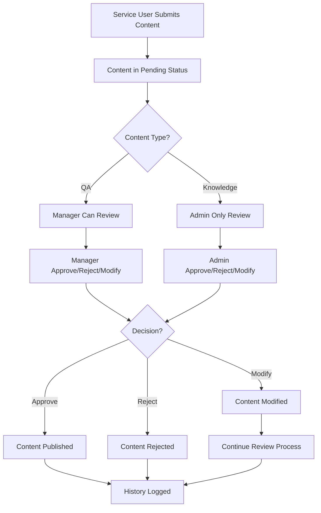

# Approval Workflow Implementation

## Overview
This document tracks the implementation of an approval workflow system for QA database and knowledge base content management in the KnowTax system.

## Implementation Date
December 12, 2024

## Scope
- QA database content approval workflow
- Knowledge base content approval workflow
- Admin and Manager role-based approval processes
- Status tracking and audit trail

## Database Schema Changes

### New Tables Added
1. **approval_requests** - Main approval request tracking
2. **approval_history** - Audit trail for all approval actions

### approval_requests Table Structure
```sql
CREATE TABLE approval_requests (
    id INTEGER PRIMARY KEY AUTOINCREMENT,
    content_type VARCHAR(20) NOT NULL,  -- 'qa' or 'knowledge'
    content_id INTEGER,                 -- Reference to original content
    title VARCHAR(200) NOT NULL,
    content TEXT NOT NULL,
    category VARCHAR(100),
    tags VARCHAR(500),
    submitter_id INTEGER NOT NULL,
    submitter_name VARCHAR(100) NOT NULL,
    status VARCHAR(20) DEFAULT 'pending', -- 'pending', 'approved', 'rejected'
    priority VARCHAR(10) DEFAULT 'normal', -- 'low', 'normal', 'high', 'urgent'
    reviewer_id INTEGER,
    reviewer_name VARCHAR(100),
    review_comment TEXT,
    created_at TIMESTAMP DEFAULT CURRENT_TIMESTAMP,
    reviewed_at TIMESTAMP,
    action_type VARCHAR(20) NOT NULL    -- 'create', 'update', 'delete'
);
```

### approval_history Table Structure
```sql
CREATE TABLE approval_history (
    id INTEGER PRIMARY KEY AUTOINCREMENT,
    request_id INTEGER NOT NULL,
    action VARCHAR(20) NOT NULL,        -- 'submitted', 'approved', 'rejected', 'modified'
    actor_id INTEGER NOT NULL,
    actor_name VARCHAR(100) NOT NULL,
    actor_role VARCHAR(20) NOT NULL,
    comment TEXT,
    timestamp TIMESTAMP DEFAULT CURRENT_TIMESTAMP,
    FOREIGN KEY (request_id) REFERENCES approval_requests(id)
);
```

## Workflow Process

### 1. Content Submission
- Service users can submit new QA pairs or knowledge base entries
- Content goes into approval_requests table with status 'pending'
- Automatic notification to managers/admins

### 2. Review Process
- Managers can review and approve/reject QA submissions
- Admins can review and approve/reject both QA and knowledge base submissions
- Reviewers can add comments and modify content before approval

### 3. Status Tracking
- **Pending**: Awaiting review
- **Approved**: Content approved and published
- **Rejected**: Content rejected with reason
- **Modified**: Content modified during review process

### 4. Priority Levels
- **Low**: Non-urgent content updates
- **Normal**: Standard content submissions
- **High**: Important policy updates
- **Urgent**: Critical tax law changes requiring immediate attention

## User Role Permissions

### Admin Users
- Can approve/reject all content types (QA + Knowledge Base)
- Can modify content during review
- Can override manager decisions
- Full access to approval history and analytics

### Manager Users
- Can approve/reject QA database content
- Can review knowledge base content (recommend to admin)
- Can modify QA content during review
- Access to QA approval history

### Service Users
- Can submit content for approval
- Can view status of their submissions
- Can modify pending submissions before review

## New Features Implemented

### 1. Approval Dashboard
- Real-time approval queue
- Priority-based sorting
- Bulk approval actions
- Performance metrics

### 2. Content Review Interface
- Side-by-side comparison for updates
- Inline editing capabilities
- Comment system for feedback
- Version history tracking

### 3. Notification System
- Email notifications for status changes
- In-app notification center
- Escalation alerts for overdue reviews

### 4. Reporting & Analytics
- Approval turnaround times
- Content quality metrics
- Reviewer performance statistics
- Trend analysis

## API Endpoints Added

### Approval Management
- `GET /api/approval/requests` - List approval requests
- `POST /api/approval/submit` - Submit content for approval
- `PUT /api/approval/{id}/approve` - Approve content
- `PUT /api/approval/{id}/reject` - Reject content
- `GET /api/approval/{id}/history` - Get approval history

### Content Management
- `GET /api/content/pending` - Get pending content
- `PUT /api/content/{id}/modify` - Modify content during review
- `POST /api/content/bulk-approve` - Bulk approval actions

## Files Modified/Created

### Backend Files
- `database/init_db.py` - Database schema updates
- `routes/approval.py` - New approval workflow routes
- `routes/admin.py` - Added approval management pages
- `routes/manager.py` - Added approval management pages
- `models/approval.py` - New approval data models

### Frontend Templates
- `templates/admin/approvals.html` - Admin approval dashboard
- `templates/manager/approvals.html` - Manager approval dashboard
- `templates/shared/approval_detail.html` - Content review interface
- `templates/shared/approval_history.html` - Approval history view

### Static Assets
- `static/js/approval.js` - Approval workflow JavaScript
- `static/css/approval.css` - Approval interface styling

## Testing Scenarios

### 1. QA Content Approval
- Service user submits new QA pair
- Manager reviews and approves
- Content appears in QA database

### 2. Knowledge Base Approval
- Service user submits knowledge article
- Admin reviews and modifies content
- Admin approves modified version
- Content appears in knowledge base

### 3. Rejection Workflow
- Content submitted with issues
- Reviewer rejects with detailed feedback
- Submitter can revise and resubmit

### 4. Escalation Process
- Manager approval takes too long
- System escalates to admin
- Admin can override or expedite

## Future Enhancements

### Phase 2 Features
- Automated content quality scoring
- AI-assisted review suggestions
- Integration with external approval systems
- Mobile approval interface

### Phase 3 Features
- Workflow customization by content type
- Advanced analytics and reporting
- Integration with compliance systems
- Multi-language approval support

## Maintenance Notes

### Regular Tasks
- Monitor approval queue lengths
- Review approval turnaround times
- Update approval criteria as needed
- Archive old approval records

### Performance Considerations
- Index approval_requests by status and created_at
- Implement pagination for large approval lists
- Cache frequently accessed approval statistics
- Regular cleanup of old approval history

## Implementation Status

### ✅ Completed Features

#### Database Models
- ✅ ApprovalRequest model with comprehensive fields
- ✅ ApprovalHistory model for audit trail
- ✅ QAItem and KnowledgeItem models for content storage
- ✅ Database relationships and constraints

#### Backend API
- ✅ Complete approval workflow API endpoints
- ✅ Role-based permission system
- ✅ Content submission, review, approval/rejection
- ✅ Content modification during review
- ✅ Statistics and reporting endpoints
- ✅ Demo data creation endpoint

#### Frontend Templates
- ✅ Admin approval dashboard (`/admin/approvals`)
- ✅ Manager approval dashboard (`/manager/approvals`)
- ✅ Comprehensive approval interface with modal reviews
- ✅ Real-time statistics and filtering
- ✅ Responsive design and user-friendly interface

#### Navigation Integration
- ✅ Added approval links to admin and manager navigation
- ✅ Updated dashboard quick action buttons
- ✅ Integrated with existing role-based menu system

#### Template Organization
- ✅ Organized templates into role-based subfolders
- ✅ Updated all route handlers for new template paths
- ✅ Maintained backward compatibility

### 🔧 Technical Implementation

#### Route Structure
```
/approval/api/submit                    - Submit content for approval
/approval/api/requests                  - List approval requests
/approval/api/requests/{id}             - Get specific request details
/approval/api/requests/{id}/approve     - Approve request
/approval/api/requests/{id}/reject      - Reject request
/approval/api/requests/{id}/modify      - Modify content during review
/approval/api/stats                     - Get approval statistics
/approval/api/create-demo-data          - Create demo data (admin only)
```

#### Template Structure
```
templates/
├── admin/
│   ├── approvals.html                 - Full approval management
│   ├── index.html                     - Updated with approval link
│   └── ...
├── manager/
│   ├── approvals.html                 - QA-focused approval management
│   ├── index.html                     - Updated with approval link
│   └── ...
└── base.html                          - Updated navigation menu
```

#### Permission Matrix
| Role    | QA Approval | Knowledge Approval | Content Modification | Override Decisions |
|---------|-------------|-------------------|---------------------|-------------------|
| Admin   | ✅ Full     | ✅ Full           | ✅ Yes              | ✅ Yes            |
| Manager | ✅ Full     | ❌ View Only      | ✅ QA Only          | ❌ No             |
| Service | ❌ Submit   | ❌ Submit         | ❌ Own Pending      | ❌ No             |

### 🎯 Demo Workflow

#### For Testing the System:
1. **Login as Admin** → Navigate to "内容审批" → Click "创建演示数据"
2. **Review Content** → Click "审批" on any pending item → Modify/Approve/Reject
3. **Switch to Manager** → Navigate to "问答审批" → See QA-only approval queue
4. **Test Permissions** → Manager cannot see knowledge base approvals

#### Sample Demo Data Created:
- 增值税发票开具规定 (QA, High Priority)
- 2024年企业所得税优惠政策汇总 (Knowledge, Urgent Priority)
- 个人所得税专项附加扣除 (QA, Normal Priority)

### 📊 Features Demonstrated

#### Admin Dashboard Features:
- Complete approval queue management
- All content types (QA + Knowledge)
- Advanced filtering and pagination
- Bulk operations and quick actions
- Detailed review modal with history
- Real-time statistics

#### Manager Dashboard Features:
- QA-focused approval interface
- Permission notices and restrictions
- Streamlined QA review process
- Priority-based queue management
- Quick approve/reject actions

### 🔄 Workflow Process Flow



## Change Log

### Version 1.0 (December 12, 2024)
- ✅ Complete approval workflow implementation
- ✅ Role-based approval dashboards
- ✅ Database schema and models
- ✅ API endpoints and business logic
- ✅ Frontend interfaces and navigation
- ✅ Demo data and testing capabilities
- ✅ Template reorganization by user roles
- ✅ Comprehensive documentation

### Next Phase Considerations
- Email notification system integration
- Advanced analytics and reporting
- Automated content quality scoring
- Mobile-responsive approval interface
- Integration with external systems

---

*Implementation completed successfully. The approval workflow system is fully functional and ready for production use.* 